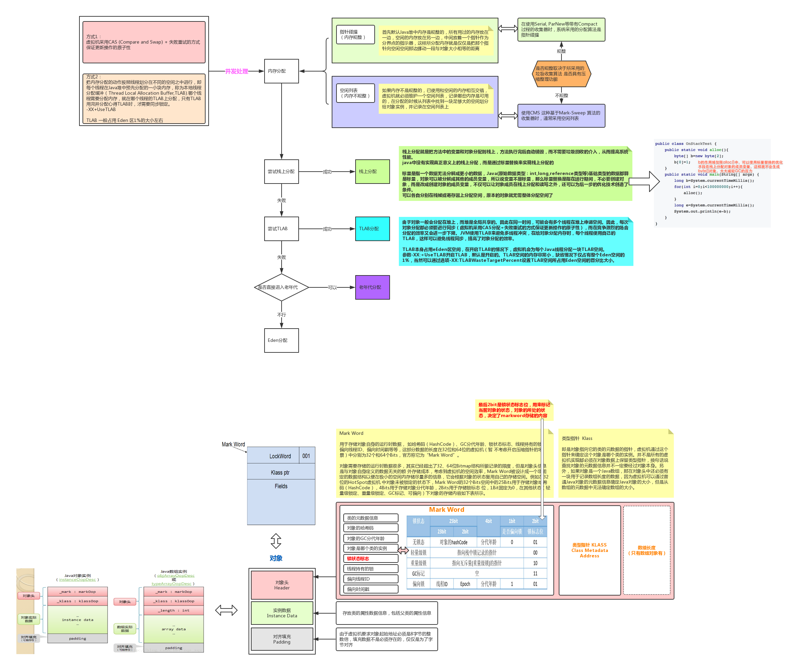
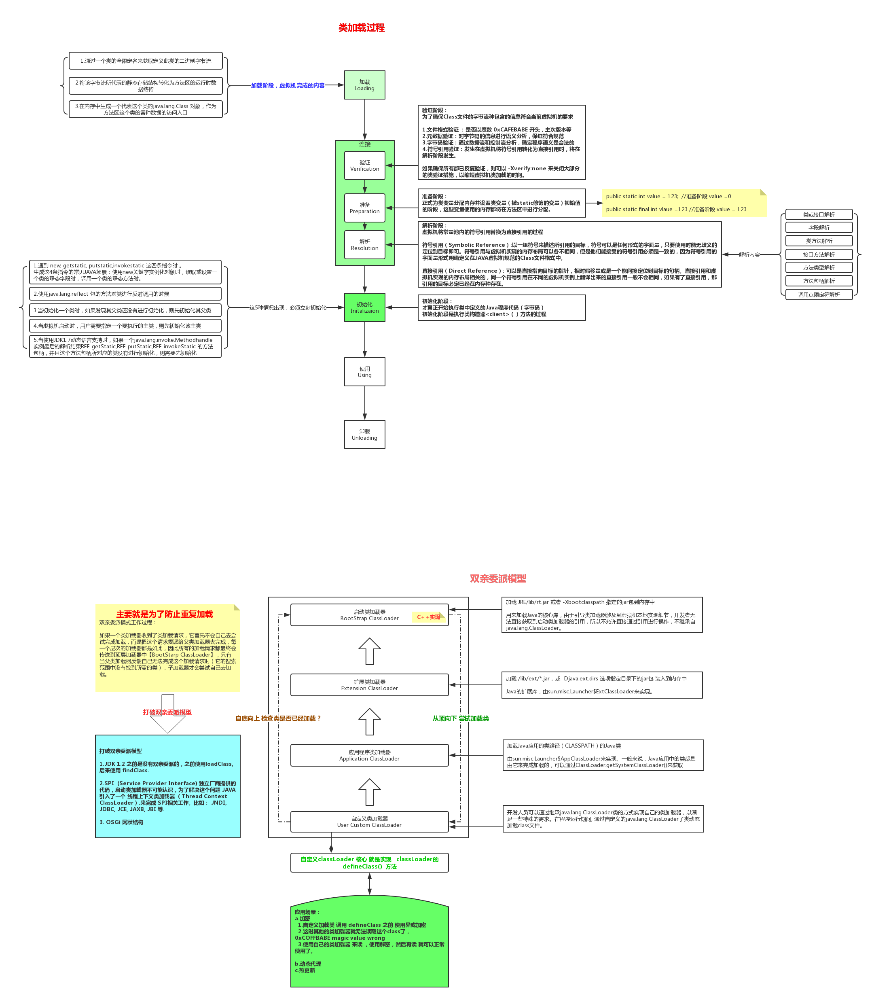
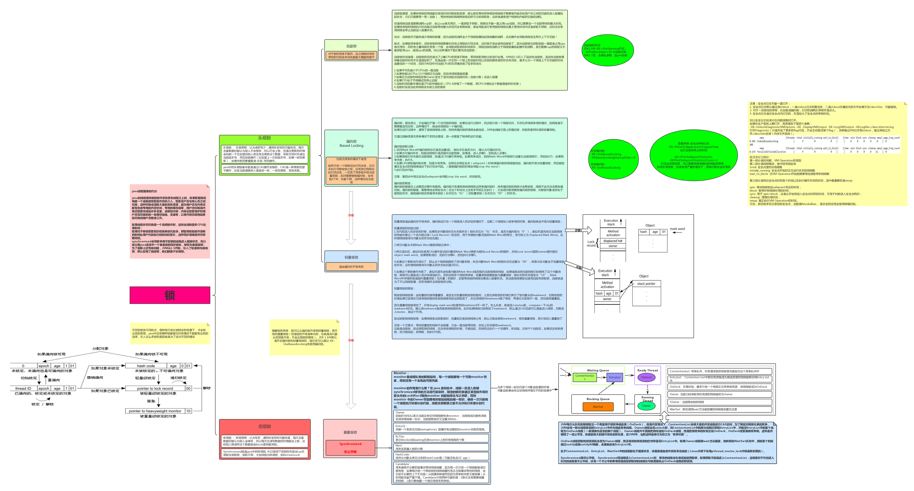
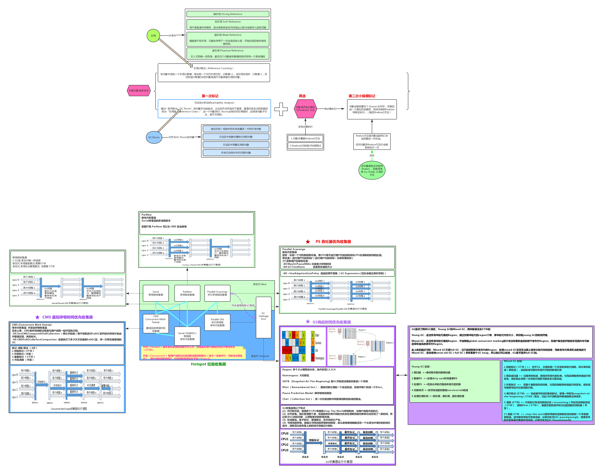
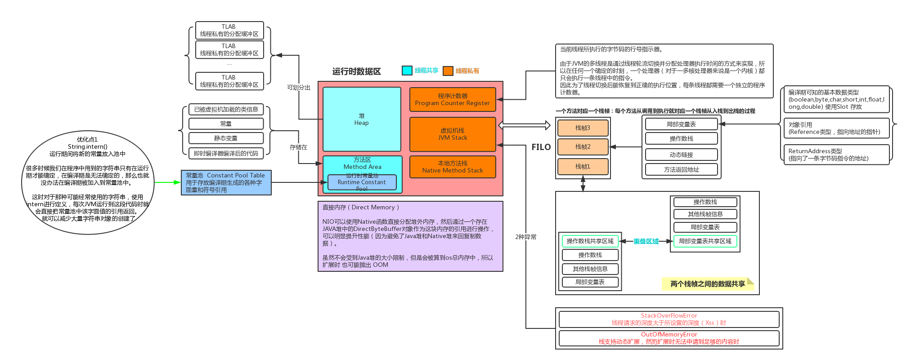

# Tech_Diagrams  技术图鉴
* 基于Draw.io 
* 个人收集和总结的所涉及到的一些全端技术流程分析,组织架构图
* 持续学习更新中~

<table>
    <tr>
        <td>Name</td> 
        <td>Category</td> 
        <td>Content</td> 
   </tr>
    <tr>
        <td rowspan="4">Architecture</td>    
        <td>Distributed system</td>
        <td>
            1.分布式存储  
            2.分布式事务   
            3.分布式锁-redis   
            4.一致性算法   
        </td>  
    </tr>
    <tr>
        <td>幂等</td>  
        <td>
            1.接口幂等  
            2.MQ消息幂等-消息丢失/重复
        </td>  
    </tr>
    <tr>
        <td>数据一致性</td>  
        <td>
            1.数据库与缓存数据一致性
        </td>  
    </tr>
    <tr>
        <td>性能优化</td>
        <td>
            1.后端性能优化 
            2.前端性能优化
        </td>
    </tr>
    </th columnspan="3">
    <tr>
        <td rowspan="6">MiddleWare</td>
        <td>Elastic Stack</td>
        <td>
            1.架构  
            2.核心原理分析
        </td>    
    </tr>
    <tr>
        <td>Kafka</td>
        <td>
            1.架构  
            2.producer  
            3.Consumer  
            4.问题-解决记录  
            5.面试题  
            6.顺序消费问题  
            7.时间轮算法  
            8.消息补偿机制  
            9.testing  
        </td>    
    </tr>
    <tr>
        <td>Redis</td>
        <td>
            1.基础架构  
            2.数据结构  
            3.布隆过滤器  
            4.缓存雪崩-缓存穿透  
            5.过期策略和内存淘汰机制  
            6.持久化  
        </td>
    </tr>
    <tr>
        <td>API GateWay</td>
        <td>
            1.基本功能与定位
        </td>
    </tr>
    <tr>
        <td>Apache Camel</td>
        <td>
            1.基本功能与定位
        </td>
    </tr>  
    <tr>
        <td>Apache Cassandra</td>
        <td>
            1.core  
            2.内部机制  
            3.clusters  
        </td>
    </tr>    
    </th columnspan="3">
    <tr>
        <td rowspan="5">Java</td>
        <td>核心</td>
        <td>
            1.对象创建及分配 
            2.类加载 
            3.GC 
            4.JVM运行时数据区  
        </td>
    </tr>
    <tr>
        <td>JUC</td>
        <td>
            1.锁 
            2.AQS 
            3.ThreadLocal 
            4.CompletableFuture 
            5.ThreadPool
        </td>
    </tr>
    <tr>
        <td>Guava</td>
        <td>
            1.RateLimiter 
        </td>
    </tr>
    <tr>
        <td>Netty</td>
        <td>
            1.core  
            2.EventLoop  
            3.Clusters  
            4.Work-flow  
            5.参数  
            6.FastThreadLocal  
        </td>
    </tr>
</table>

 
 
 
---

| Name               | Content                                                      |
| ------------------ | ------------------------------------------------------------ |
| Architecture       | DDD| 
| Cloud Compute      | 1.GCP 2.Cloud Foundry                                   |
| JavaScript         |                                                              |
| Kubernetes         |                                                              |
| Node               |                                                              |
| RDBMS              | 1.Mysql                                                      |
| Sap                | 1.Sap Hana                                                   |
|                    |                                                              |
| 算法与数据结构       |                                                              |
|                    |                                                              |

 
---
 

# Example:

## Java

| # | content | drawio |
| --- | ------- | ------ |
| 1 | 对象创建及分配 |  |
| 2 | 类加载 |  |
| 3 | 锁 |  |
| 4 | AQS |  |
| 5 | GC |  |
| 6 | JVM |  |
| 7 | ThreadPool |  |
| 8 | Guava-Ratelimiter |  |
| 9 | | |
| 10 | | |

---

